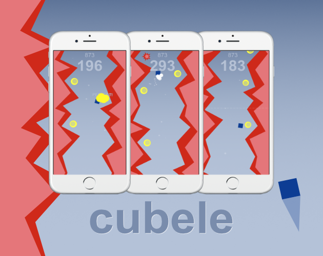
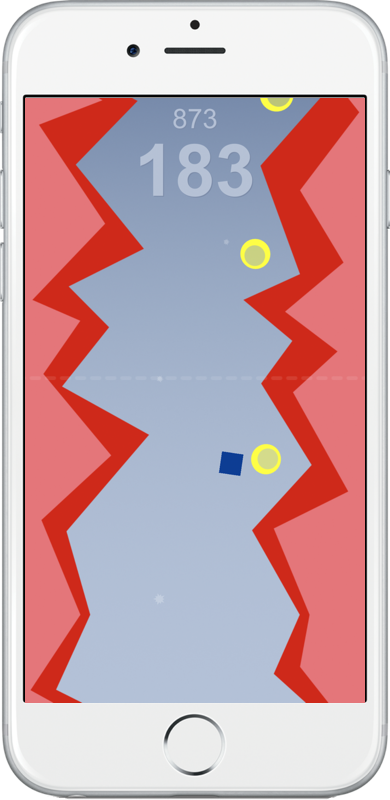
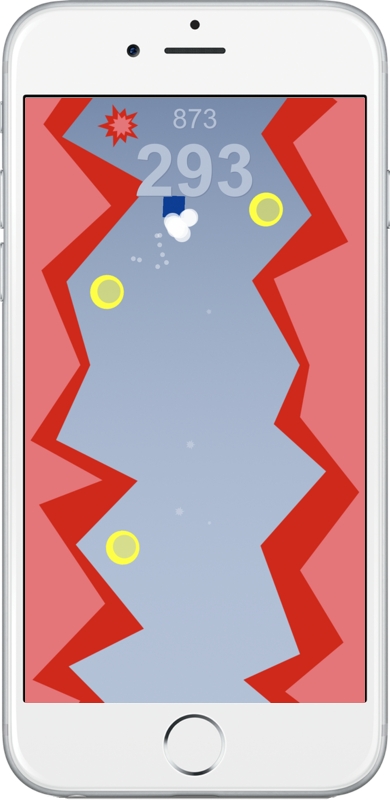
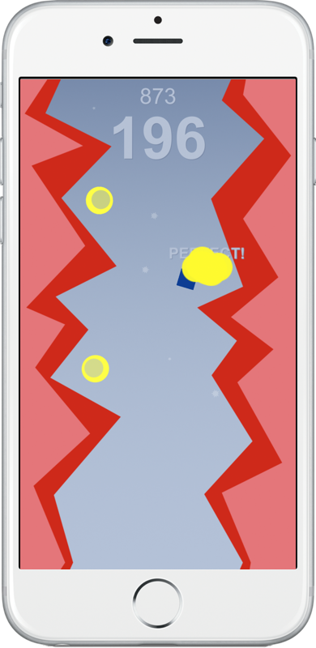

# Cubele

Casual game for [iOS](https://itunes.apple.com/us/app/cubele/id1450186462?ls=1&mt=8) and [Android](https://play.google.com/store/apps/details?id=org.kneego.cubele) mobile phones.

## Videos

[Youtube: Cubele - Trailer](https://www.youtube.com/watch?v=OIl2MvuC12E)

## Used tools
[Affinity Designer](https://affinity.serif.com/en-gb/designer/) - for drawing  
[Bfxr](http://bfxr.net/), [ocenaudio](https://www.ocenaudio.com) - for SFX and sounds  
[ecrettmusic](http://ecrettmusic.com/)​ - for the music  
[Unity3d](https://unity.com) - hmm...

## Pictures

### Cover

### From game

